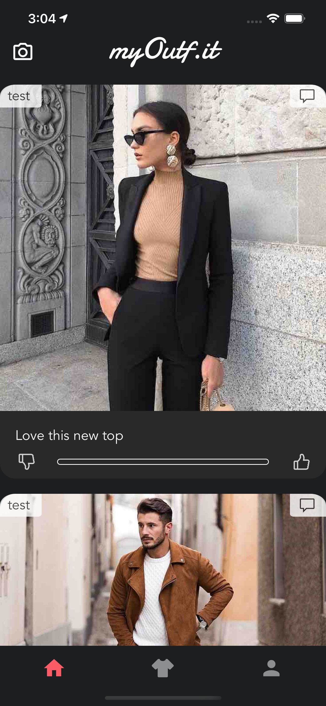
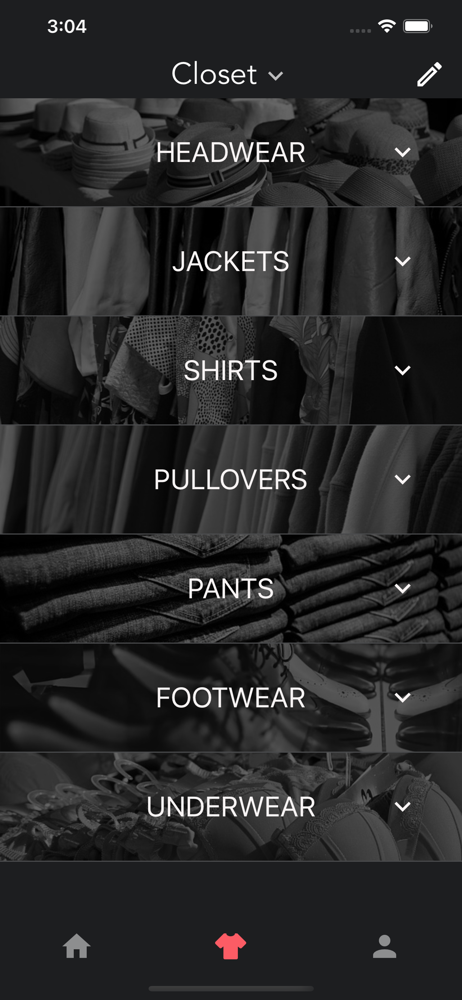
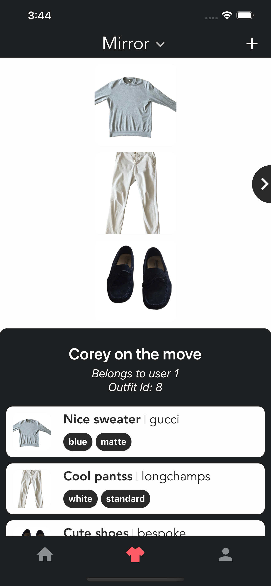
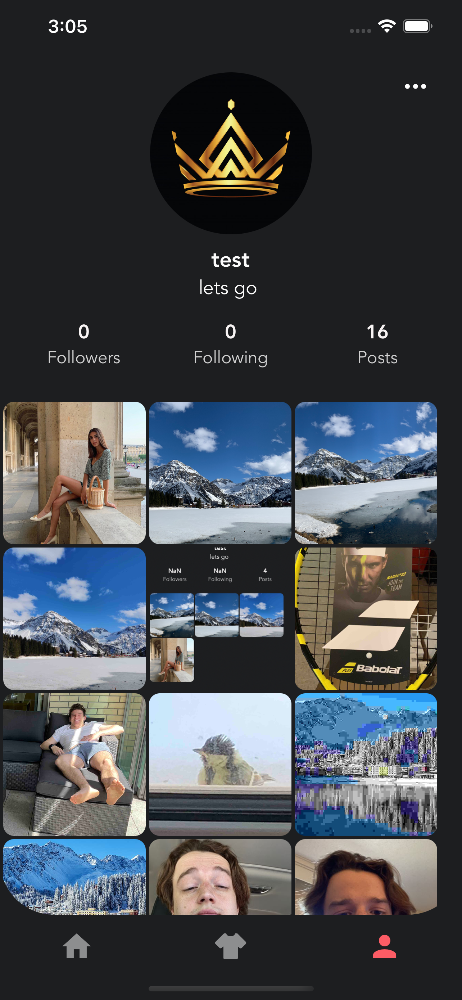

<!-- PROJECT SHIELDS -->
<!--
*** I'm using markdown "reference style" links for readability.
*** Reference links are enclosed in brackets [ ] instead of parentheses ( ).
*** See the bottom of this document for the declaration of the reference variables
*** for contributors-url, forks-url, etc. This is an optional, concise syntax you may use.
*** https://www.markdownguide.org/basic-syntax/#reference-style-links
-->

[![Stargazers][stars-shield]][stars-url]
[![Issues][issues-shield]][issues-url]

<!-- PROJECT LOGO -->
<br />
<p align="center">
  <a href="https://github.com/sopra-fs21-group-20/closet-server">
    
  </a>

  <h3 align="center">MyOutfit Client</h3>

  <p align="center">
    The frontend powering MyOutfit
    <br />
    <a href="https://github.com/sopra-fs21-group-20/closet-client"><strong>Explore the docs »</strong></a>
    <br />
    <br />
    <a href="https://myoutf.it">View Demo</a>
    ·
    <a href="https://github.com/sopra-fs21-group-20/closet-client/issues">Report Bug</a>
    ·
    <a href="https://github.com/sopra-fs21-group-20/closet-client/issues">Request Feature</a>
  </p>
</p>


<!-- TABLE OF CONTENTS -->
<details open="open">
  <summary><h2 style="display: inline-block">Table of Contents</h2></summary>
  <ol>
    <li>
      <a href="#about-the-project">About The Project</a>
      <ul>
        <li><a href="#built-with">Built With</a></li>
      </ul>
    </li>
    <li>
      <a href="#getting-started">Getting Started</a>
      <ul>
        <li><a href="#prerequisites">Prerequisites</a></li>
        <li><a href="#installation">Installation</a></li>
      </ul>
    </li>
    <li><a href="#usage">Usage</a></li>
    <li><a href="#roadmap">Roadmap</a></li>
    <li><a href="#contributing">Contributing</a></li>
    <li><a href="#license">License</a></li>
    <li><a href="#contact">Contact</a></li>
    <li><a href="#acknowledgements">Acknowledgements</a></li>
  </ol>
</details>


<!-- ABOUT THE PROJECT -->
## About The Project

MyOutfit pursues the goal of fusing the real and virtual world of wearing, buying, selling and marketing clothes and accessoires.
The client provides touch and feel to MyOutfit mobile application. The client depends on the [server](https://github.com/sopra-fs21-group-20/closet-server) following a client/server architecture.


### Built With

* [React Native](https://github.com/facebook/react-native)
* [Expo](https://github.com/expo/expo)

### Illustrations

#### The Feed
When launching the App you get greeted by the Feed. This is the place where you see what your friends wear and where you find inspiration for new outfits and new clothes you could buy in the future.
The live poll feature together with the commen section allows you to get feedback on how you like the posted outfit.

<div align="center">
  
</div>

#### The Closet
Here is where all your clothes are stored. As can be seen everything is organized in a drawer-like structure to find items faster.

<div align="center">
  
</div>

#### The Mirror
All outfits are found in the mirror. This is the digital equivalent to trying on outfits or laying them out on the floor.

<div align="center">
  
</div>

#### The Profile Screen
The Profile screen summarizes all your posts and account information at one place. This helps you to keep track of personal metrics.

<div align="center">
  
</div>

<!-- GETTING STARTED -->
## Getting Started

To get a local copy up and running follow these simple steps:

### Prerequisites

First you need to ensure Node.js is install. Then install Expo CLI on your device. 

* You can download Node.js [here](https://nodejs.org/en/download/)
* Install Expo CLI: `npm install --global expo-cli`

### Installation

1. Clone the repo
   ```sh
   git clone https://github.com/sopra-fs21-group-20/closet-client.git
   ```
2. Install dependencies
   ```sh
   npm install
   ```

<!-- USAGE EXAMPLES -->
## Usage

Start the development server with  
```sh
expo start
```

You now have a local server process running.

In order to actually run and emulate the server process as it would look on a mobile device, you need to have an emulator installed. 
Please find more details at the following links:

For iOS: [here](https://docs.expo.io/workflow/ios-simulator/)
For Android: [here](https://docs.expo.io/workflow/android-studio-emulator/)

## Roadmap

The current highest priority contributions are:

* Bug fixing and seamless functionality cross-platform
* Integration of a proprietary background removal feature
* Extension of the community features

Please see the [open issues](https://github.com/sopra-fs21-group-20/closet-client/issues) for a further list of proposed features (and known issues).

<!-- CONTRIBUTING -->
## Contributing

1. Fork the Project
2. Create your Feature Branch (`git checkout -b feature/AmazingFeature`)
3. Commit your Changes (`git commit -m 'Add some AmazingFeature'`)
4. Push to the Branch (`git push origin feature/AmazingFeature`)
5. Open a Pull Request

<!-- LICENSE -->
## License

Distributed under the Creative Commons Attribution-NonCommercial-NoDerivatives 4.0 International Public License. See `LICENSE` for more information.

<!-- CONTACT -->
## Contact

This implementation is the work of the entire MyOutfit team, specifically the frontend team Joel Weber and Matteo Gamba.
They can be reached via their respective GitHub accounts.

Project Link: [https://github.com/sopra-fs21-group-20/closet-client](https://github.com/sopra-fs21-group-20/closet-client)

<!-- ACKNOWLEDGEMENTS -->
## Acknowledgements

* [University of Zurich Institut for Informatik S.E.A.L.](https://www.ifi.uzh.ch/en/seal.html)

<!-- MARKDOWN LINKS & IMAGES -->
<!-- https://www.markdownguide.org/basic-syntax/#reference-style-links -->
[stars-shield]: https://img.shields.io/github/stars/sopra-fs21-group-20/closet-server.svg?style=plastic
[stars-url]: https://github.com/sopra-fs21-group-20/closet-server/stargazers
[issues-shield]: https://img.shields.io/github/issues/sopra-fs21-group-20/closet-server.svg?style=plastic
[issues-url]: https://github.com/sopra-fs21-group-20/closet-server/issues
[license-shield]: https://img.shields.io/github/license/sopra-fs21-group-20/closet-server.svg?style=plastic
[license-url]: https://github.com/sopra-fs21-group-20/closet-server/blob/master/LICENSE.txt
